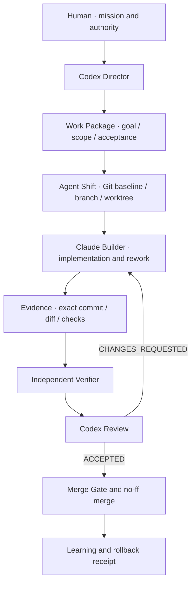

# Agent OS

Agent OS 是一套面向 Codex 与 Claude Code 的 AI 原生软件交付机制。它不是让两个 Agent 共用一个编辑器，而是用 Git、Worktree、工作包、权限、证据和验收门禁，把它们组织成一支可以持续协作的软件团队。

> Codex 是产品与技术总监：定义目标、边界、验收标准并作最终决策。
> Claude Code 是实现负责人：在独立 Worktree 中开发、验证和返工。
> Git 是版本神经系统；Evidence 是组织记忆；Agent OS 是治理与恢复层。

当前版本：Agent OS v0.3，配套 Agent Shift protocol v2。

## 它解决什么问题

- 多 Agent 同时改同一目录，责任和文件归属不清。
- Agent 自报“完成”，但没有精确提交、测试结果或真实交付证据。
- Codex 验收后发现问题，却由 Codex 自己接管实现，角色逐渐混乱。
- Claude Code 模型额度耗尽、服务商限流或长时间 thinking，任务无人接管。
- 失败后不知道发生在哪里、使用了什么权限，也不知道如何回滚。
- 协作经验只存在于聊天里，下一次仍要人工重新管理。

Agent OS 要求每次交付都能回答五个问题：为什么这样做、使用了什么权限、失败在哪里、如何回滚、下一次为什么会更好。

## 架构



仓库包含两个协同 Skill：

- `agent-shift`：Git 基线、分支、Worktree、交接状态和 Merge Gate。
- `agent-os`：工作包、单写者锁、权限、证据、独立验证、五问成熟度、模型路由、回滚和学习。

Agent OS 依赖 Agent Shift，因此安装器会同时安装两者。

## 系统要求

- macOS 或 Linux（使用 POSIX `fcntl` 文件锁）。
- Python 3.10+、Git。
- Codex 与 Claude Code CLI。
- 可选：CC Switch。只有需要按角色选模型和额度自动兜底时才需要。

## 安装

```bash
git clone https://github.com/chukong-creator/agent-os-skill.git
cd agent-os-skill
./scripts/install.sh
export PATH="$HOME/.local/bin:$PATH"
```

安装器会：

1. 把 `agent-shift` 和 `agent-os` 链接到 `${CODEX_HOME:-$HOME/.codex}/skills/`。
2. 在 `${BIN_DIR:-$HOME/.local/bin}` 创建两个 CLI 包装命令。
3. 遇到同名 Skill 或命令时拒绝覆盖，保护现有安装。

安装后新建一个 Codex 任务，让 Codex 重新发现 Skill。验证：

```bash
agent-shift --help
agent-os --help
```

如果 `~/.local/bin` 不在 PATH，请把上面的 `export` 加入你的 shell 配置。

## 初始化项目

项目必须先有干净、可提交的 Git 基线：

```bash
cd /path/to/project
git status --short

agent-shift init . --name "My Project"
```

把仓库中的 [`examples/project.gitignore`](examples/project.gitignore) 合并进项目 `.gitignore`。它会保留可审查的项目配置、Policy、Work Package、Review 和 Improvement，同时排除 SQLite 状态、活动日志、原始 Run Evidence 和临时 Worktree。先检查规则，再提交：

```bash
sed -n '1,200p' /path/to/agent-os-skill/examples/project.gitignore
git status --short --ignored
```

保留项目已有的 `AGENTS.md`；如果项目还没有，可以复制 [`examples/AGENTS.md.template`](examples/AGENTS.md.template) 作为起点，并补成真实项目规则：

```bash
test -f AGENTS.md || cp /path/to/agent-os-skill/examples/AGENTS.md.template AGENTS.md
```

检查并完善 `.agent-shift/project.json` 中的工作单元、实现路径、保护路径和验证命令，然后初始化 Agent OS：

```bash
agent-os init . \
  --id my-project \
  --name "My Project" \
  --mission "The durable value this product creates"

agent-shift protect-main . --work-unit default

git add \
  .gitignore AGENTS.md CLAUDE.md .githooks \
  .claude/settings.json .claude/agents/verifier.md \
  .agent-shift/project.json \
  .agent-os/project.json .agent-os/policy
AGENT_SHIFT_ALLOW_MAIN_COMMIT=1 \
  git commit -m "governance: initialize Agent OS"

agent-shift baseline . --work-unit default
agent-shift doctor .
agent-os doctor . --strict
```

初始化器不会覆盖已有的 `AGENTS.md` 或 `CLAUDE.md`。不要在提交治理基线前启动实现 Run。

## 一次完整交付

### 1. Codex 创建并批准 Work Package

```bash
agent-os package-create . \
  --id wp-001 \
  --work-unit default \
  --goal "Observable outcome" \
  --objective "Bounded implementation objective" \
  --mission-alignment "Why this advances the mission" \
  --priority P1 \
  --expected-gain "Expected user or business gain" \
  --selected-approach "Chosen approach" \
  --rationale "Why this approach fits" \
  --allow src tests \
  --verify "npm test" \
  --rollback-check "npm test"

agent-os package-ready . --id wp-001
git add .agent-os/work-packages/wp-001.json
AGENT_SHIFT_ALLOW_MAIN_COMMIT=1 \
  git commit -m "plan: approve wp-001"
agent-shift baseline . --work-unit default
```

### 2. Claude 在独立 Worktree 实现

```bash
agent-os run-start . --package wp-001 --run run-wp-001-r1 --agent claude
agent-os claude-start . --run run-wp-001-r1
agent-os claude-status . --run run-wp-001-r1
```

### 3. Evidence、独立验证和 Codex 验收

```bash
agent-os verify . --run run-wp-001-r1
agent-os verifier . --run run-wp-001-r1
agent-os learn . --run run-wp-001-r1 \
  --outcome no-change \
  --observation "Observed result" \
  --reason "Why no protocol change is justified"
agent-os maturity-report . --run run-wp-001-r1
```

通过时：

```bash
agent-os review . --run run-wp-001-r1 \
  --decision ACCEPTED \
  --summary "Acceptance evidence"
agent-os merge . --run run-wp-001-r1
```

需要改进时，Codex 给出结构化 finding，Claude 继续在原 Worktree 返工：

```bash
agent-os review . --run run-wp-001-r1 \
  --decision CHANGES_REQUESTED \
  --summary "What is not yet acceptable" \
  --required-change "F-001: expected behavior and pass condition"
agent-os rework-start . --run run-wp-001-r1
agent-os claude-start . --run run-wp-001-r1
```

Codex 不替 Claude 完成普通返工；Codex 保持产品判断、风险判断和最终验收权。

## CC Switch 模型路由与额度兜底

模型路由是可选能力。Agent OS 只读 CC Switch 的 Claude Provider 配置，并把选中的环境变量注入当前 Claude 子进程；不会改变 CC Switch 的全局当前 Provider，也不会把 API Key 写入命令、日志或 Evidence。

创建配置：

```bash
mkdir -p "$HOME/.config/agent-os"
cp examples/model-routing.example.json "$HOME/.config/agent-os/model-routing.json"
```

把示例中的 Provider 名称和模型 ID 改成你在 CC Switch 中的真实配置。配置文件只能保存 Provider 名称、模型、effort 和 fallback 链，不能保存凭据。

检查安全元数据：

```bash
agent-os provider-list
agent-os route-resolve --profile builder
agent-os route-resolve --profile reviewer
```

默认行为：

- `BUILDING / REWORK` 使用 Builder profile。
- `READY_FOR_REVIEW / CODEX_REVIEWING` 使用只读 Reviewer profile。
- 明确的 quota、429、余额不足或 Provider 终态错误，才进入有限 fallback 链。
- 每个 profile 在一个角色周期内最多尝试一次；链耗尽后进入 `RUNTIME_FAILED`。
- 未知错误不会盲目切模型。
- Builder 连续 5 分钟、Reviewer 连续 15 分钟没有 job update 时标记 `SUSPECTED_STALL`，但不会在旧 writer 仍活跃时启动第二个 writer。

## 观察执行过程

```bash
agent-os status .
agent-os claude-status . --run run-wp-001-r1
tail -f .agent-os/runs/run-wp-001-r1/events.jsonl
cat .agent-os/runs/run-wp-001-r1/routing-state.json
```

运行时文件和 Evidence 默认留在项目的 `.agent-os/`、`.agent-shift/` 中。稳定治理文件应进入 Git，活动日志、SQLite 状态和临时 Worktree 应由项目 `.gitignore` 排除。

## 权限与安全边界

- 一个 Work Package 一个 owner；同一 Worktree 一个 writer。
- Builder 只能修改 allowlist 内路径，不能 merge、push、deploy 或修改治理。
- Reviewer 只有 `Read`、`Glob`、`Grep`。
- 实现 Agent 不能验收自己的输出。
- 高风险、凭据、生产、发布、付款和不可逆操作必须回到 Codex 或用户决策。
- 未知 Agent 状态 fail closed；不能确认没有 writer 时拒绝启动。
- 不要把真实 CC Switch 数据库、Claude settings、Run 记录或本机备份提交到此仓库。

## 回滚与恢复

先检查回滚计划，再在明确授权下执行：

```bash
agent-os rollback . --run run-wp-001-r1 --reason "Why rollback is needed"
agent-os rollback . --run run-wp-001-r1 --reason "..." --execute
```

自动路径只回滚 Agent OS 精确记录的最新 no-ff merge，并生成新的 revert commit 和 Receipt。存在外部副作用时，Git 回滚不能伪装成外部系统已经恢复。

只读恢复检查：

```bash
agent-os recover .
```

## 更新与卸载

更新：

```bash
cd agent-os-skill
git pull --ff-only
```

因为安装使用符号链接，拉取后即更新 Skill。升级前先阅读 diff，并在一次可回滚的项目上 canary 验证。

安全卸载：

```bash
cd agent-os-skill
./scripts/uninstall.sh
```

卸载器只删除精确指向当前 checkout 的 Skill 链接和 CLI 包装文件；遇到用户自己的同名文件会拒绝删除。它不会删除任何项目中的 `.agent-os`、`.agent-shift`、Git 分支、Worktree 或 Evidence。

## 验证开发版本

```bash
python3 skills/agent-os/scripts/test_agent_os_routing.py
python3 skills/agent-os/scripts/test_agent_os_v03.py
```

第二个测试会在临时目录中创建 disposable Git 仓库和 Worktree，不应对真实项目执行破坏性操作。

---

## English overview

Agent OS is a governed delivery layer for Codex and Claude Code. Codex owns product and technical direction, scope, acceptance, and merge authority. Claude Code owns implementation and ordinary rework in an isolated Git worktree.

The repository ships two Skills:

- **Agent Shift** provides Git baselines, protected branches, isolated Agent worktrees, observable handoffs, and merge gates.
- **Agent OS** adds Work Packages, permission manifests, single-writer locks, exact-commit evidence, independent verification, five-question maturity reports, finite model fallback, safe rollback, and learning proposals.

Quick start:

```bash
git clone https://github.com/chukong-creator/agent-os-skill.git
cd agent-os-skill
./scripts/install.sh
export PATH="$HOME/.local/bin:$PATH"
```

Start a new Codex task after installation so the Skills are rediscovered. CC Switch is optional and is only used for process-local provider/model routing; credentials are never stored in the repository routing configuration.

The central rule is simple: the implementation Agent may produce a candidate, but only an independent evidence path and Codex review can decide whether it is deliverable.
