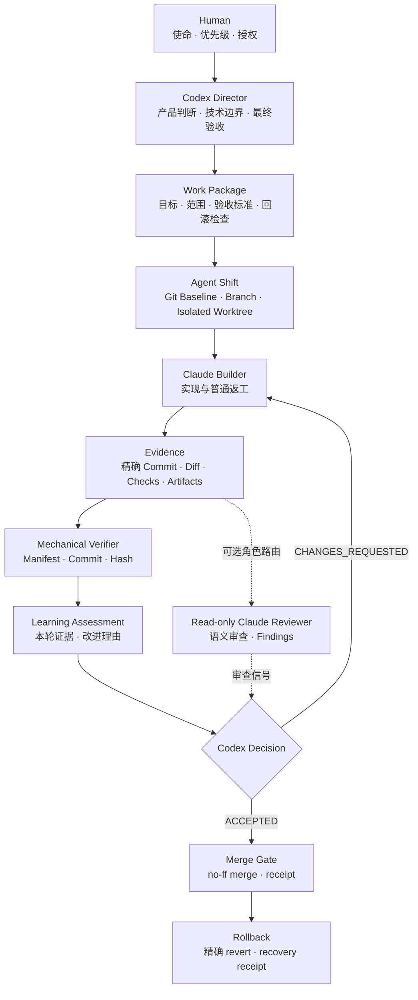
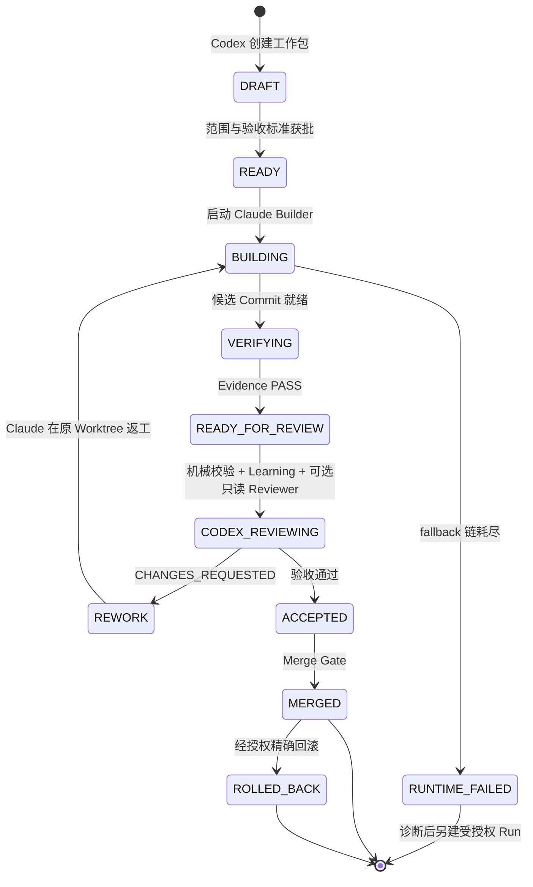
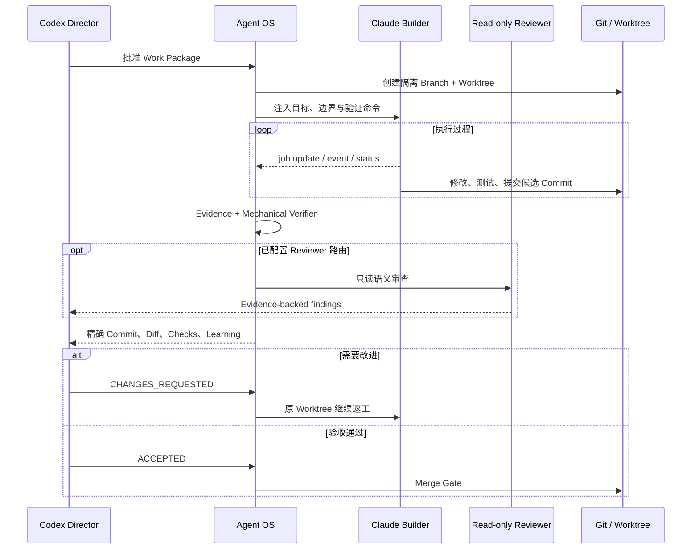
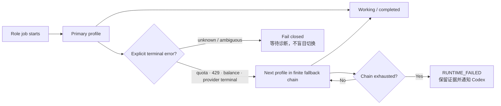

<p align="center">
  
</p>

# Agent OS

<p align="center">
  <strong>把 Codex、Claude Code 与 Git 组织成一支可观察、可验收、可恢复、会进化的 AI 软件团队。</strong>
</p>

<p align="center">
  
</p>

Agent OS 不是“让 Claude 帮 Codex 写代码”的提示词，而是一套 AI 原生软件交付机制。它用 **Git Baseline、隔离 Worktree、Work Package、权限边界、Evidence、Review Gate 与有限模型兜底**，把多个 Agent 从共用编辑器的临时协作，升级为责任清晰的软件组织。

> **Codex** 是产品与技术总监：定义目标、边界、验收标准并作最终决策。
>
> **Claude Code** 是实现负责人：在独立 Worktree 中开发、验证和返工。
>
> **Git** 是版本神经系统；**Evidence** 是组织记忆；**Agent OS** 是治理与恢复层。

当前版本：**Agent OS v0.3 + Agent Shift protocol v2**。

## 30 秒看懂

| 角色 / 系统 | 决策权与责任 | 不应该做什么 |
|---|---|---|
| Human | 提供使命、优先级与最终授权 | 每一步都手动盯 Agent |
| Codex Director | 拆目标、定边界、派工、审查证据、验收与合并 | 接管 Claude 的普通返工 |
| Claude Builder | 在隔离 Worktree 实现、测试、提交候选结果 | 自己验收、合并、发布 |
| Mechanical Verifier | 校验 Manifest、精确 Commit 与 Evidence 哈希 | 把机械 PASS 当作产品验收 |
| Read-only Claude Reviewer（可选） | 在配置模型路由后做语义审查并向 Codex 提供 finding | 修改实现或作最终决策 |
| Git + Agent Shift | 固化基线、隔离写入、记录交接、执行 Merge Gate | 用聊天记录代替版本事实 |
| Agent OS | 管工作包、权限、证据、路由、回滚与学习 | 保存密钥或绕过用户授权 |



## 为什么不是一段更长的 Prompt

| 常见多 Agent 协作 | Agent OS |
|---|---|
| 多个 Agent 同时修改同一目录 | 每个工作包绑定独立 Branch / Worktree，始终单写者 |
| Agent 自报“已经完成” | 验收绑定精确 Commit、Diff、命令结果与交付物 |
| Reviewer 发现问题后直接改代码 | Reviewer 只读；Codex 给 finding；Claude 在原 Worktree 返工 |
| 人工观察模型卡住并手动切换 | 只对明确 quota / 429 / Provider 终态执行有限 fallback |
| 聊天结束后上下文消失 | 工作包、事件、Evidence、Review 与 Improvement 留下组织记忆 |
| 失败时只能重来 | 知道失败位置、权限边界、恢复入口和精确回滚点 |

## 核心能力

| 能力 | Agent OS 如何实现 | 你得到什么 |
|---|---|---|
| **目标契约** | Work Package 固化目标、范围、验收标准、预期增益和回滚检查 | Agent 不会把“做了很多”当作“拿到结果” |
| **Git 基线** | Agent Shift 记录可审计 baseline，保护主分支 | 每次工作都从已知状态出发 |
| **隔离执行** | 一包一 Branch / Worktree，canonical worktree 单写者锁 | 并行协作不互相覆盖 |
| **过程可见** | 状态、job update、事件流和路由状态持续落盘 | 随时知道 Claude 在做什么、卡在哪里 |
| **证据验收** | 精确 Commit、允许路径、验证命令、产物与机械 verifier | Codex 根据事实验收，不凭自报 |
| **返工闭环** | `CHANGES_REQUESTED` 生成结构化 finding，原 Builder 继续返工 | 角色不漂移，责任不断裂 |
| **模型路由** | Builder / Reviewer 独立 profile，显式终态触发有限 fallback | 某个模型额度用光时不会无限卡住 |
| **恢复与学习** | 精确 revert、恢复 receipt、maturity report、improvement proposal | 失败可恢复，下一次有依据地变好 |

### 一个交付怎样流动



## 适合什么场景

- **个人开发者同时经营多个项目**：不用反复解释协作规则，项目自己携带治理配置。
- **Codex 限额前后交接**：Claude 继续实现；限额恢复后 Codex 从 Git 和 Evidence 接回验收。
- **多 Agent 并行开发**：不重叠 work unit 的工作包进入不同 Worktree；同一 work unit 仍保持单写者。
- **复杂功能需要多轮返工**：Codex 保持验收权，Claude 保持实现责任。
- **模型额度或 Provider 不稳定**：可配置角色路由和有限 fallback，失败显式终止。
- **高风险、长期演进的产品**：权限、失败位置、回滚与学习都有可审计记录。

如果只是一次性的单文件低风险修改，直接使用一个 Agent 往往更轻。Agent OS 的价值出现在**任务跨轮次、跨模型、需要验收或必须恢复**的时候。

## 快速开始

### 系统要求

- macOS 或 Linux（使用 POSIX `fcntl` 文件锁）
- Python 3.10+、Git
- Codex 与 Claude Code CLI
- 可选：CC Switch，仅在需要按角色选模型和额度自动兜底时使用

### 1. 安装两个 Skills

```bash
git clone https://github.com/chukong-creator/agent-os-skill.git
cd agent-os-skill
./scripts/install.sh
export PATH="$HOME/.local/bin:$PATH"
```

安装器会把 `agent-shift` 和 `agent-os` 链接到 `${CODEX_HOME:-$HOME/.codex}/skills/`，并在 `${BIN_DIR:-$HOME/.local/bin}` 创建 CLI 包装命令。遇到同名 Skill 或命令时会拒绝覆盖。

新建一个 Codex 任务，让 Codex 重新发现 Skills，然后验证：

```bash
agent-shift --help
agent-os --help
```

如果 `~/.local/bin` 不在 PATH，请把上面的 `export` 加入 shell 配置。

### 2. 在 10 分钟内接入一个项目

项目必须先有干净、可提交的 Git 基线：

```bash
cd /path/to/project
git status --short
agent-shift init . --name "My Project"
```

把 [`examples/project.gitignore`](examples/project.gitignore) 合并进项目 `.gitignore`。保留项目已有的 `AGENTS.md`；没有时可从 [`examples/AGENTS.md.template`](examples/AGENTS.md.template) 起步：

```bash
test -f AGENTS.md || \
  cp /path/to/agent-os-skill/examples/AGENTS.md.template AGENTS.md

agent-os init . \
  --id my-project \
  --name "My Project" \
  --mission "The durable value this product creates"

agent-shift protect-main . --work-unit default
```

检查 `.agent-shift/project.json` 中的工作单元、实现路径、保护路径和验证命令，然后提交治理基线：

```bash
git add \
  .gitignore AGENTS.md CLAUDE.md .githooks \
  .claude/settings.json .claude/agents/verifier.md \
  .agent-shift/project.json \
  .agent-os/project.json .agent-os/policy

AGENT_SHIFT_ALLOW_MAIN_COMMIT=1 \
  git commit -m "governance: initialize Agent OS"

agent-shift baseline . --work-unit default
agent-shift doctor .
agent-os doctor . --strict
```

初始化器不会覆盖已有的 `AGENTS.md` 或 `CLAUDE.md`。不要在提交治理基线前启动实现 Run。

### 3. 跑一次受治理交付

Codex 先创建并批准 Work Package：

```bash
agent-os package-create . \
  --id wp-001 \
  --work-unit default \
  --goal "Observable outcome" \
  --objective "Bounded implementation objective" \
  --mission-alignment "Why this advances the mission" \
  --priority P1 \
  --expected-gain "Expected user or business gain" \
  --selected-approach "Chosen approach" \
  --rationale "Why this approach fits" \
  --allow src tests \
  --verify "npm test" \
  --rollback-check "npm test"

agent-os package-ready . --id wp-001
git add .agent-os/work-packages/wp-001.json
AGENT_SHIFT_ALLOW_MAIN_COMMIT=1 \
  git commit -m "plan: approve wp-001"
agent-shift baseline . --work-unit default
```

Claude 在独立 Worktree 实现：

```bash
agent-os run-start . --package wp-001 --run run-wp-001-r1 --agent claude
agent-os claude-start . --run run-wp-001-r1
agent-os claude-status . --run run-wp-001-r1
```

候选结果产生后，执行 Evidence、机械证据校验和成熟度检查：

```bash
agent-os verify . --run run-wp-001-r1
agent-os verifier . --run run-wp-001-r1
agent-os learn . --run run-wp-001-r1 \
  --outcome no-change \
  --observation "Observed result" \
  --reason "Why no protocol change is justified"
agent-os maturity-report . --run run-wp-001-r1
```

如果已经配置模型路由，还可以在 `READY_FOR_REVIEW` 阶段启动只读 Claude Reviewer。它只有 `Read`、`Glob`、`Grep`，输出语义 findings 供 Codex 参考；`agent-os verifier` 仍只负责机械证据完整性：

```bash
agent-os claude-start . --run run-wp-001-r1
agent-os claude-status . --run run-wp-001-r1
```

通过时由 Codex 验收并进入 Merge Gate：

```bash
agent-os review . --run run-wp-001-r1 \
  --decision ACCEPTED \
  --summary "Acceptance evidence"
agent-os merge . --run run-wp-001-r1
```

需要改进时，Codex 给出结构化 finding，Claude 在**原 Worktree** 继续返工：

```bash
agent-os review . --run run-wp-001-r1 \
  --decision CHANGES_REQUESTED \
  --summary "What is not yet acceptable" \
  --required-change "F-001: expected behavior and pass condition"
agent-os rework-start . --run run-wp-001-r1
agent-os claude-start . --run run-wp-001-r1
```

## 看见 Claude 正在做什么

你不需要盯住 Claude 的终端。Agent OS 把关键过程写成可追踪的状态和事件：

```bash
# 项目全局状态
agent-os status .

# 当前 Claude job 与心跳
agent-os claude-status . --run run-wp-001-r1

# 持续观察事件流
tail -f .agent-os/runs/run-wp-001-r1/events.jsonl

# 查看当前模型、fallback 次数与错误分类
cat .agent-os/runs/run-wp-001-r1/routing-state.json
```



稳定治理文件应该进入 Git；活动日志、SQLite 状态、原始 Run Evidence 和临时 Worktree 应由项目 `.gitignore` 排除。

## CC Switch 模型路由与额度兜底

模型路由是可选能力。Agent OS 只读 CC Switch 的 Claude Provider 配置，把选中的环境变量注入**当前 Claude 子进程**；不会改变 CC Switch 的全局当前 Provider，也不会把 API Key 写入命令、日志或 Evidence。

```bash
mkdir -p "$HOME/.config/agent-os"
cp /path/to/agent-os-skill/examples/model-routing.example.json \
  "$HOME/.config/agent-os/model-routing.json"

agent-os provider-list
agent-os route-resolve --profile builder
agent-os route-resolve --profile reviewer
```

把 [`examples/model-routing.example.json`](examples/model-routing.example.json) 中的 Provider 名称和模型 ID 改成 CC Switch 中的真实配置。该文件只能保存 Provider 名称、模型、effort 和 fallback 链，不能保存凭据。



- `BUILDING / REWORK` 使用 Builder profile。
- `READY_FOR_REVIEW / CODEX_REVIEWING` 使用只读 Reviewer profile。
- 明确 quota、429、余额不足或 Provider 终态错误，才进入有限 fallback 链。
- 每个 profile 在一个角色周期内最多尝试一次；链耗尽后进入 `RUNTIME_FAILED`。
- 未知错误不会盲目切模型。
- Builder 连续 5 分钟、Reviewer 连续 15 分钟没有 job update 时标记 `SUSPECTED_STALL`，但不会在旧 writer 仍活跃时启动第二个 writer。

## 成熟 Agent 必须回答的五个问题

每次交付都应留下足够证据回答：

1. **为什么这样做？** 目标、使命关联、选择理由和替代方案是什么？
2. **使用了什么权限？** 谁能写哪些路径，谁只能读，谁拥有合并权？
3. **失败在哪里？** 是实现、验证、模型额度、Provider 还是外部系统失败？
4. **如何回滚？** 对应哪个精确 Commit，Git 与外部副作用分别怎样恢复？
5. **下一次为什么会更好？** 哪条证据支持修改规则，或者为什么本轮不应修改？

`agent-os maturity-report` 会检查这五类证据是否真的存在；历史记录不会为了看起来完整而伪造补齐。

## 权限、安全与停止条件

- 一个 Work Package 一个 owner；同一 canonical Worktree 一个 writer。
- Builder 只能修改 allowlist 内路径，不能 merge、push、deploy 或修改治理。
- Reviewer 只有 `Read`、`Glob`、`Grep`。
- 实现 Agent 不能验收自己的输出。
- 高风险、凭据、生产、发布、付款和不可逆操作必须回到 Codex 或用户决策。
- 未知 Agent 状态 fail closed；不能确认旧 writer 已退出时拒绝启动第二个 writer。
- fallback 链耗尽即停止并进入 `RUNTIME_FAILED`，不会无限重试。
- 不要提交真实 CC Switch 数据库、Claude settings、Run 记录、本机备份或任何密钥。

## 回滚与恢复

先检查回滚计划，再在明确授权下执行：

```bash
agent-os rollback . --run run-wp-001-r1 --reason "Why rollback is needed"
agent-os rollback . --run run-wp-001-r1 --reason "..." --execute
```

自动路径只回滚 Agent OS 精确记录的最新 no-ff merge，并生成新的 revert Commit 和 Receipt。存在外部副作用时，Git 回滚不能伪装成外部系统已经恢复。

只读恢复检查：

```bash
agent-os recover .
```

## 仓库结构

```text
agent-os-skill/
├── README.md
├── docs/assets/               # README visual assets
├── examples/                  # project policy and routing examples
├── scripts/
│   ├── install.sh             # safe symlink-based installer
│   └── uninstall.sh           # only removes links owned by this checkout
└── skills/
    ├── agent-shift/           # Git baseline, worktree, handoff, merge gate
    └── agent-os/              # package, permissions, evidence, review, routing
```

Agent OS 依赖 Agent Shift，因此安装器会同时安装两者。

## 更新、卸载与开发验证

更新：

```bash
cd agent-os-skill
git pull --ff-only
```

安装使用符号链接，拉取后即可更新 Skill。升级前应阅读 diff，并在一个可回滚项目上 canary 验证。

安全卸载：

```bash
cd agent-os-skill
./scripts/uninstall.sh
```

卸载器只删除精确指向当前 checkout 的 Skill 链接和 CLI 包装文件；不会删除项目中的 `.agent-os`、`.agent-shift`、Git 分支、Worktree 或 Evidence。

开发验证：

```bash
python3 skills/agent-os/scripts/test_agent_os_routing.py
python3 skills/agent-os/scripts/test_agent_os_v03.py
```

第二个测试会在临时目录中创建 disposable Git 仓库和 Worktree，不会对真实项目执行破坏性操作。

---

## English overview

**Agent OS turns Codex, Claude Code, and Git into an observable, governed, and recoverable AI software team.**

- **Codex Director** owns mission alignment, scope, acceptance criteria, findings, merge authority, and final delivery decisions.
- **Claude Builder** owns implementation and ordinary rework inside an isolated Git worktree.
- **Agent Shift** provides exact baselines, protected branches, worktree isolation, observable handoffs, and merge gates.
- **Agent OS** adds Work Packages, permission manifests, single-writer locks, exact-commit evidence, mechanical evidence verification, optional read-only review, five-question maturity reports, finite model fallback, safe rollback, and learning proposals.

Quick start:

```bash
git clone https://github.com/chukong-creator/agent-os-skill.git
cd agent-os-skill
./scripts/install.sh
export PATH="$HOME/.local/bin:$PATH"
```

Start a new Codex task after installation so both Skills are rediscovered. CC Switch is optional and is only used for process-local provider/model routing; credentials are never stored in the routing configuration.

The central rule is simple: **an implementation Agent may produce a candidate, but only verified evidence and Codex review can decide whether it is deliverable.**
